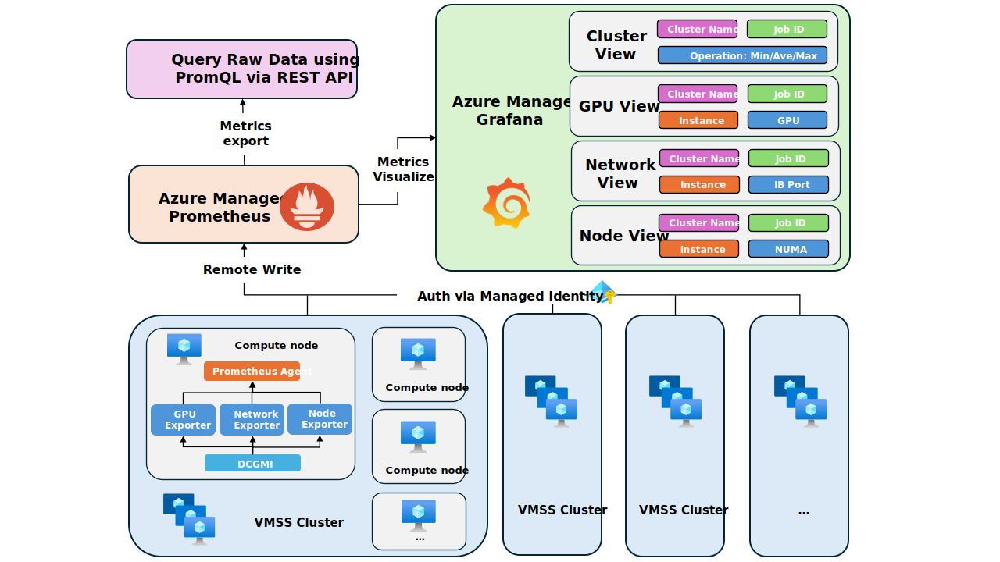
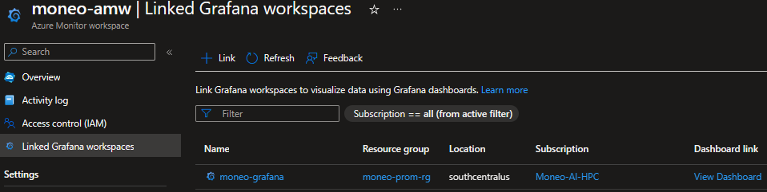

# Moneo #

## Description ##

Moneo is a distributed GPU system monitor for AI workflows. It orchestrates metric collection (DCGMI + Prometheus DB) and visualization (Grafana) across multi-GPU/node systems. This provides useful insights into workflow and system level characterization.

Moneo offers flexibility with 3 deployment methods:

1. The prefered method using Azure Managed Prometheus/Grafana and Moneo linux services for collection (Headless deployment)
2. Using Azure Application Insights/Azure Monitor Workspace(AMW) (Headless deployment w/ App Insights).
3. Using Moneo CLI with a dedicate headnode to host local Prometheus/Grafana servers (Local Grafana Deployment)

Moneo Headless Method:



<details>
<summary>Metrics</summary>

There five categories of metrics that Moneo monitors:

1. GPU Counters

    - Compute/Memory Utilization
    - SM and Memory Clock frequency
    - Temperature
    - Power
    - ECC Counts (Nvidia)
    - GPU Throttling (Nvidia)
    - XID code (Nvidia)
2. GPU Profiling Counters
    - SM Activity
    - Memory Dram Activity
    - NVLink Activity
    - PCIE Rate
3. InfiniBand Network Counters
    - IB TX/RX rate
    - IB Port errors
    - IB Link FLap
4. CPU Counters
    - Utilization
    - Clock frequency
5. Memory
    - Utilization

</details>

<details>
<summary>Grafana Dashboards</summary>

1. Menu: List of available dashboards.


   Note: When viewing GPU dashboards make sure to note whether you are using Nvidia or AMD GPU nodes and select the proper dashboard.

2. Cluster View: contains  min, max, average across devices for GPU/IB metrics per VM.


3. GPU Device Counters: Detailed view of node level GPU counters.


4. GPU Profiling Counters: Node level profiling metrics require additional overhead which may affect workload performance. Tensor, FP16, FP32, and FP64 activity are disabled by default but can be switched on by CLI command.


5. InfiniBand Network Counters: Detailed view of node level IB network metrics.


6. Node View: Detailed view of node level CPU, Memory, and Network metrics.


</details>

## Minimum Requirements ##

- python >=3.7 installed

- OS Support:
  - Ubuntu 18.04, 20.04, 22.04
  - AlmaLinux 8.6

### Manager Node Requirements ###

Note: Not applicable if using Azure Managed Grafana/Prometheus

- docker 20.10.23 (May work with other versions but this has been tested.)
- parallel-ssh 2.3.1-2 (May work with other versions but this has been tested.)
- Manager node must be able to ssh to itself

### Worker node requirements ###

- Nvidia Architecture supported (only for Nvidia GPU monitoring):
  - Volta
  - Ampere
  - Hopper
- Installed with install script at time of deployment (If not installed):
  - DCGM 3.1.6 (For Nvidia deployments)
  - Check install scripts for the various python packages installed.

## Usage ##

### Deploying Moneo ###

Get the code:

- Clone Moneo from Github.

    ```sh
        # get the code
        git clone https://github.com/Azure/Moneo.git
        cd Moneo
        # install dependency
        sudo apt-get install pssh
    ```

    Note: If you are using an [Azure Ubuntu HPC-AI](https://github.com/Azure/azhpc-images) VM image you can find the Moneo in this path: /opt/azurehpc/tools/Moneo

### Prefered Moneo Deployment ###

The prefered way to deploy Moneo is the headless method using Azure Managaed Grafana and Prometheus resources.

Complete the steps listed here: [Headless Deployment Guide](./docs/HeadlessDeployment.md)

### Alternative deployment using Moneo CLI and head node ###

This method requires a deploying of a head node to host the local Prometheus database and Grafana server.

- The headnode must have enough storage available to facilitate data collection
- Grafana and Prometheus are accessed via web browser. Ensure proper access from web browser to headnode IP.

Complete the steps listed here: [Local Grafana Deployment Guide](./docs/LocalGrafanaDeployment.md)

### Moneo CLI ###

Moneo CLI provides an alternative way to deploy and update Moneo manager and worker nodes. Although linux services are prefered this offers an alternative way to control Moneo.

#### CLI Usage ####

- ```python3 moneo.py [-d/--deploy] [-c hostfile] {manager,workers,full}```
- ```python3 moneo.py [-s/--shutdown] [-c hostfile] {manager,workers,full}```
- ```python3 moneo.py [-j JOB_ID ] [-c hostfile]```
- i.e. ```python3 moneo.py -d -c ./hostfile full```

Note: For more options check the Moneo help menu

```sh
    python3 moneo.py --help
```

### Access the Grafana Portal ###

- For Azure Managed Grafana the dashboards can be accessed via the endpoint provided on the resource overview.
- For Moneo CLI deployment with a dedicated head node the Grafana portal can be reached via browser: http://master-ip-or-domain:3000
- If Azure Monitor is used navigate to the Azure Monitor Workspace on The Azure portal.
  
## User Docs ##

- [Headless Deployment Guide](./docs/HeadlessDeployment.md)
- [Local Grafana Deployment Guide](./docs/LocalGrafanaDeployment.md)
- To get started with job level filtering see: [Job Level Filtering](./docs/JobFiltering.md)
- Slurm epilog/prolog integration: [Slurm example](./examples/slurm/README.md)
- To deploy moneo-worker inside container: [Moneo-exporter](./docs/Moneo-exporter.md)
- To integrate Moneo with Azure Application Insights dashboard see: [Azure Monitor](./docs/AzureMonitorAgent.md)
- To expose customized metrics by using custom exporter [Custom Exporter](./docs/CustomExporter.md)
- For Geneva ingestion (internal Microsoft) see: [Geneva](./docs/GenevaAgent.MD)

## Known Issues ##

- NVIDIA exporter may conflict with DCGMI

  There're [two modes for DCGM](https://docs.nvidia.com/datacenter/dcgm/latest/dcgm-user-guide/getting-started.html#content): embedded mode and standalone mode.

  If DCGM is started as embedded mode (e.g., `nv-hostengine -n`, using no daemon option `-n`), the exporter will use the DCGM agent while DCGMI may return error.

  It's recommended to start DCGM in standalone mode in a daemon, so that multiple clients like exporter and DCGMI can interact with DCGM at the same time, according to [NVIDIA](https://docs.nvidia.com/datacenter/dcgm/latest/dcgm-user-guide/getting-started.html#standalone-mode).

  > Generally, NVIDIA prefers this mode of operation, as it provides the most flexibility and lowest maintenance cost to users.

- Moneo will attempt to install a tested version of DCGM if it is not present on the worker nodes. However, this step is skipped if DCGM is already installed. In instances DCGM installed may be too old.

  This may cause the Nvidia exporter to fail. In this case it is recommended that DCGM be upgraded to atleast version 2.4.4.
  To view which exporters are running on a worker just run ```ps -eaf | grep python3```

## Troubleshooting ##

1. For Managed Grafana (headless) deployment
    - Verify that the user managed identity is assigned to the VM resource.
    - Verify the prerequisite configure file (`Moneo/src/worker/publisher/config/managed_prom_config.json`) is configured correctly on each worker node.
    - On the worker nodes verify functionality of prometheus agent remote write:
        - Check prometheus docker with `sudo docker logs prometheus | grep 'Done replaying WAL'`
        It will have the result like this:

    ```Bash
        ts=2023-08-07T07:25:49.636Z caller=dedupe.go:112 component=remote level=info remote_name=6ac237 url="<ingestion_endpoint>" msg="Done replaying WAL" duration=8.339998173s
    ```

    - Check Azure Grafana's is linked to Azure Prometheus workspace.
        - This can be done by accessing settings in Grafana dashboard and ensuring the ingestion link for the Managed Prometheus is being used for the datasource url.
        - You can also verify The Managed Prometheus resource in the portal is linked with the managed Grafana resource
        

2. For deployments with a Headnode:

    - Verifying Grafana and Prometheus containers are running:
        - Check browser http://master-ip-or-domain:3000 (Grafana), http://master-ip-or-domain:9090 (Prometheus)
        - On Manager node terminal run ```sudo docker container ls```
    

3. All deployments:
    - Verifying exporters on worker node:
        - ``` ps -eaf | grep python3 ```

        

## Contributing ##

This project welcomes contributions and suggestions.  Most contributions require you to agree to a
Contributor License Agreement (CLA) declaring that you have the right to, and actually do, grant us
the rights to use your contribution. For details, visit https://cla.opensource.microsoft.com.

When you submit a pull request, a CLA bot will automatically determine whether you need to provide
a CLA and decorate the PR appropriately (e.g., status check, comment). Simply follow the instructions
provided by the bot. You will only need to do this once across all repos using our CLA.

This project has adopted the [Microsoft Open Source Code of Conduct](https://opensource.microsoft.com/codeofconduct/).
For more information see the [Code of Conduct FAQ](https://opensource.microsoft.com/codeofconduct/faq/) or
contact [opencode@microsoft.com](mailto:opencode@microsoft.com) with any additional questions or comments.

## Trademarks ##

This project may contain trademarks or logos for projects, products, or services. Authorized use of Microsoft
trademarks or logos is subject to and must follow
[Microsoft's Trademark & Brand Guidelines](https://www.microsoft.com/en-us/legal/intellectualproperty/trademarks/usage/general).
Use of Microsoft trademarks or logos in modified versions of this project must not cause confusion or imply Microsoft sponsorship.
Any use of third-party trademarks or logos are subject to those third-party's policies.
