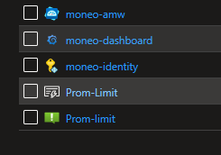

# Azure Managed Moneo Resources #

=====

## Overview ##

Usining Moneo with Azure Managed resources is the prefered Method of deployment. These instructions will set up Azure managed Grafana and Azure Managed Prometheus to ingest and visualize data from Moneo exporters. This deployment only needs to be run ones.

## Prerequisiutes ##

1. Modify resource names in the [deploy_moneo_infrastructure.sh](./deploy_moneo_infrastructure.sh) script:
Specifically:

    ``` Bash
        # Change the naming if desired
        prometheus_mon_workspace="moneo-amw"
        rgroup="moneo-rg" 
        idname="moneo-identity"
        grafana_name="moneo-dashboard"

        # change location and subscription
        alert_email="<email>"
        location="southcentralus"
        subid="<sub-id>"
    ```

2. AZ cli installed and logged in.
3. You may choose to edit the [ARM template](./managed_infra_template.json). We do not support any changes to the file so do so at your own risk.

## Deploy instructionts ##

1. Run the [deploy_moneo_infrastructure.sh](./deploy_moneo_infrastructure.sh) script.
2. It will take some time to deploy. The script will output failed deployment and or IAM assignments.
3. if the deployment is successful you should see these resources:

4. Verify/Add Grafana admin,viewer,and/or editor roles to your grafana resource.
5. The deployment is complete. You can now design the Grafana dashboards to your own specifications. Also see: [ManagedPrometheusAgent.md](../docs/ManagedPrometheusAgent.md) for details on how to launch Moneo on compute nodes and start ingesting data.
