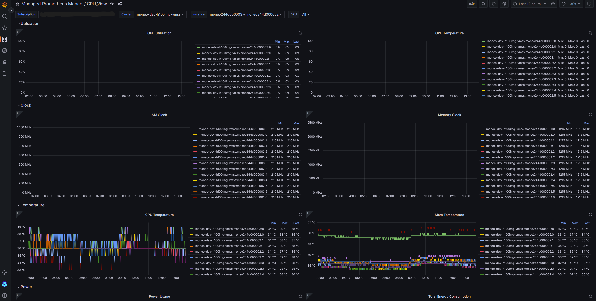

# Managed Prometheus Agent User Guide #

## Description ##

This guide will provide step-by-step instructions on how to  to publish your exporter metrics to Azure Managed Prometheus in a second-level granularity interval.

## Prequisites ##

1. An Azure Monitor Workspace (AWM), a.k.a Azure Managed Prometheus resource. See [infrastructure deployment](../deploy_managed_infra/README.md) for quick and easy Grafana and Prometheus deployment
2. Authentication
    User Managed Identity (umi)
    - Create an umi on azure portal, register umi object id on geneva portal with a metricsPublisher role, and add the Moneo service princple to the VM/VMSS
    - Navigate to your VM/VMSS resource on the portal.
    - From the left menu select "identity" 
    - From the top tabs select "User assigned"
    - Then click on "Add" this will open a blade to search for the managed identities.
    - search and select "moneo-umi".
    - Click add at the bottom of the open blade.
3. PSSH installed on manager nodes.
4. Ensure passwordless ssh is installed in you environment.
5. Config managed prometheus config file in `Moneo/src/worker/publisher/config/managed_prom_config.json`.
    Note: You can obtain your IDENTITY_CLIENT_ID in your indentity resource page and your metrics ingestion endpoint from the AWM pages you created in the Azure portal.

    ``` json
        {
            "IDENTITY_CLIENT_ID": "<identity client id>",
            "INGESTION_ENDPOINT": "<metrics ingestion endpoint>"
        }
    ```

## Steps ##

1. Ensure that all prequisites are met.

2. deploy Moneo on worker nodes:

    - Worker deployment using CLI

    ```bash
        python3 moneo.py -d -c hostlist workers -g managed_prometheus -a umi 
    ```

    Note: managed prometheus agent only support headless deployment
3. Verify functionality of prometheus agent remote write:

    a. Check prometheus docker with `sudo docker logs prometheus | grep 'Done replaying WAL'`
    It will have the result like this:

    ```Bash
    ts=2023-08-07T07:25:49.636Z caller=dedupe.go:112 component=remote level=info remote_name=6ac237 url="<ingestion_endpoint>" msg="Done replaying WAL" duration=8.339998173s
    ```

    Which means, prometheus agent's remote write is enabled.
4. At this point the remote write functionality shoud be working.
5. Check with Azure grafana (linked with AMW) dashboards to verify that the metrics are being ingested.

Note: You will have to design the dashboards or use the template dashboards in the "Moneo/deploy_managed_infra/grafana_dashboard_templates" folder.
